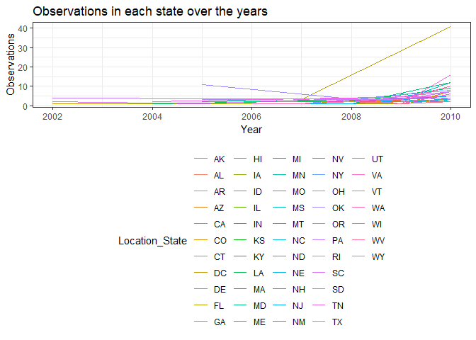
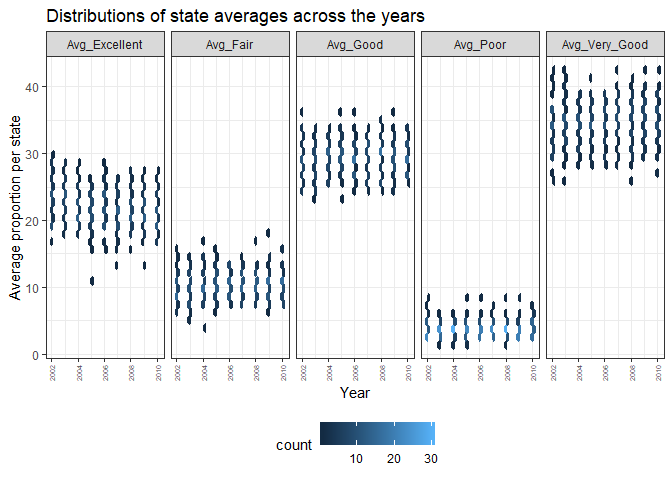

p8105\_hw3\_baw2160
================
Bryce Wong
October 8, 2018

``` r
knitr::opts_chunk$set(
  fig.width = 6,
  fig.asp = .6,
  out.width = "90%"
)

library(tidyverse)
```

    ## -- Attaching packages ------------------------------------------------------------- tidyverse 1.2.1 --

    ## v ggplot2 3.0.0     v purrr   0.2.5
    ## v tibble  1.4.2     v dplyr   0.7.6
    ## v tidyr   0.8.1     v stringr 1.3.1
    ## v readr   1.1.1     v forcats 0.3.0

    ## -- Conflicts ---------------------------------------------------------------- tidyverse_conflicts() --
    ## x dplyr::filter() masks stats::filter()
    ## x dplyr::lag()    masks stats::lag()

``` r
library(ggridges)
```

    ## 
    ## Attaching package: 'ggridges'

    ## The following object is masked from 'package:ggplot2':
    ## 
    ##     scale_discrete_manual

``` r
library(patchwork)

theme_set(theme_bw() + theme(legend.position = "bottom"))
```

Problem One:
------------

### install.packages("devtools")

``` r
devtools::install_github("p8105/p8105.datasets")
```

    ## Skipping install of 'p8105.datasets' from a github remote, the SHA1 (21f5ad1c) has not changed since last install.
    ##   Use `force = TRUE` to force installation

``` r
library(p8105.datasets)
```

### Read and clean data:

-   Formatted the data to use appropriate variable names.
-   Focused on the “Overall Health” topic.
-   Include only responses from "Excellent" to "Poor"
-   Organized responses as a factor taking levels from “Excellent” to “Poor”

``` r
brfss_data = brfss_smart2010 %>% 
  filter(Topic == "Overall Health") %>% 
  rename(Location_State = Locationabbr, Location_County = Locationdesc, Proportion = Data_value) %>%
  mutate(
    Response = as.factor(Response)
  )
```

### Answering some questions:

-   In 2002, which states were observed at 7 locations?

``` r
states_with_7_obs = brfss_data %>%  
  filter(Year == "2002") %>%
  distinct(Location_County, .keep_all = TRUE) %>% 
  count(Location_State) %>% 
  filter(n == 7)
```

**Answer:** CT, FL, NC

-   Make a “spaghetti plot” that shows the number of observations in each state from 2002 to 2010.

``` r
counts_per_state = distinct(brfss_data, Location_County, .keep_all = TRUE) %>% 
  count(Location_State, Year) 
ggplot(counts_per_state, aes(x = Year, y = n, group = Location_State)) +
  geom_line(aes(color = Location_State), alpha = .5)
```



-   Make a table showing, for the years 2002, 2006, and 2010, the mean and standard deviation of the proportion of “Excellent” responses across locations in NY State.

``` r
NY_data = brfss_data %>% 
  group_by(Location_State, Year) %>% 
  spread(key = Response, value = Proportion) %>% 
  filter(Location_State == "NY", Year %in% c("2002", "2006", "2010")) %>% 
  summarize(mean_excellent = mean(Excellent, na.rm = TRUE),
            sd_excellent = sd(Excellent, na.rm = TRUE)) %>% 
  knitr::kable(digits = 1)
NY_data
```

| Location\_State |  Year|  mean\_excellent|  sd\_excellent|
|:----------------|-----:|----------------:|--------------:|
| NY              |  2002|             24.0|            4.5|
| NY              |  2006|             22.5|            4.0|
| NY              |  2010|             22.7|            3.6|

-   For each year and state, compute the average proportion in each response category (taking the average across locations in a state). Make a five-panel plot that shows, for each response category separately, the distribution of these state-level averages over time.

``` r
state_avgs = brfss_data %>%
  spread(key = Response, value = Proportion) %>% 
  group_by(Year, Location_State) %>% 
  janitor::clean_names() %>% 
  summarize(
    avg_excellent = mean(excellent, na.rm = TRUE), 
    avg_good = mean(good, na.rm = TRUE), 
    avg_verygood = mean(very_good, na.rm = TRUE),
    avg_fair = mean(fair, na.rm = TRUE),
    avg_poor = mean(poor, na.rm = TRUE)
  )  
gather(state_avgs, key = health_score, value = averages, avg_excellent:avg_poor) %>%
  ggplot(aes(x = Year, fill = Location_State)) +
  geom_density(alpha = .5) +
  facet_grid(~health_score) + 
  viridis::scale_fill_viridis(discrete = TRUE)
```

    ## Warning: Groups with fewer than two data points have been dropped.

    ## Warning: Groups with fewer than two data points have been dropped.

    ## Warning: Groups with fewer than two data points have been dropped.

    ## Warning: Groups with fewer than two data points have been dropped.

    ## Warning: Groups with fewer than two data points have been dropped.



Problem 2:
----------

The goal is to do some exploration of this dataset. To that end, write a short description of the dataset, noting the size and structure of the data, describing some key variables, and giving illustrative examples of observations.

-   Size of the data: 1384617, 15

Then, do or answer the following (commenting on the results of each):

How many aisles are there, and which aisles are the most items ordered from? Make a plot that shows the number of items ordered in each aisle. Order aisles sensibly, and organize your plot so others can read it. Make a table showing the most popular item in each of the aisles “baking ingredients”, “dog food care”, and “packaged vegetables fruits”. Make a table showing the mean hour of the day at which Pink Lady Apples and Coffee Ice Cream are ordered on each day of the week; format this table for human readers (i.e. produce a 2 x 7 table).
