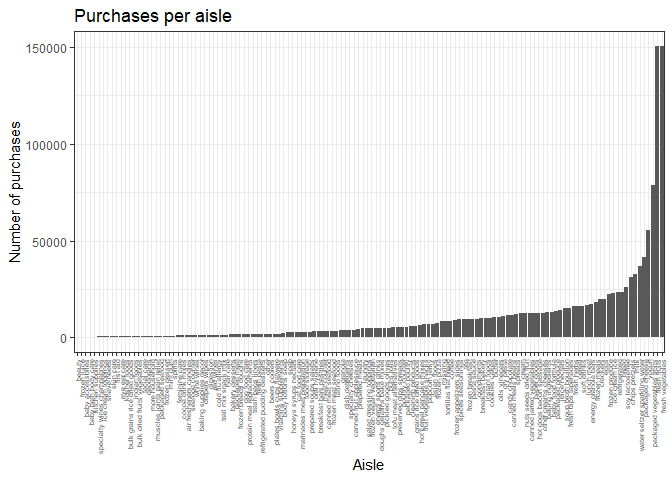

p8105\_hw3\_baw2160
================
Bryce Wong
October 8, 2018

``` r
knitr::opts_chunk$set(
  fig.width = 6,
  fig.asp = .6,
  out.width = "90%"
)

library(tidyverse)
```

    ## -- Attaching packages ------------------------------------------------------------- tidyverse 1.2.1 --

    ## v ggplot2 3.0.0     v purrr   0.2.5
    ## v tibble  1.4.2     v dplyr   0.7.6
    ## v tidyr   0.8.1     v stringr 1.3.1
    ## v readr   1.1.1     v forcats 0.3.0

    ## -- Conflicts ---------------------------------------------------------------- tidyverse_conflicts() --
    ## x dplyr::filter() masks stats::filter()
    ## x dplyr::lag()    masks stats::lag()

``` r
library(ggridges)
```

    ## 
    ## Attaching package: 'ggridges'

    ## The following object is masked from 'package:ggplot2':
    ## 
    ##     scale_discrete_manual

``` r
library(patchwork)

theme_set(theme_bw() + theme(legend.position = "bottom"))
```

Problem One:
------------

### install.packages("devtools")

``` r
devtools::install_github("p8105/p8105.datasets")
```

    ## Skipping install of 'p8105.datasets' from a github remote, the SHA1 (21f5ad1c) has not changed since last install.
    ##   Use `force = TRUE` to force installation

``` r
library(p8105.datasets)
```

### Read and clean data:

-   Formatted the data to use appropriate variable names.
-   Focused on the “Overall Health” topic.
-   Include only responses from "Excellent" to "Poor"
-   Organized responses as a factor taking levels from “Excellent” to “Poor”

``` r
brfss_data = brfss_smart2010 %>% 
  filter(Topic == "Overall Health") %>% 
  rename(Location_State = Locationabbr, Location_County = Locationdesc, Proportion = Data_value) %>%
  mutate(
    Response = as.factor(Response)
  )
```

### Answering some questions:

-   In 2002, which states were observed at 7 locations?

``` r
states_with_7_obs = brfss_data %>%  
  filter(Year == "2002") %>%
  distinct(Location_County, .keep_all = TRUE) %>% 
  count(Location_State) %>% 
  filter(n == 7)
```

**Answer:** CT, FL, NC

-   Make a “spaghetti plot” that shows the number of observations in each state from 2002 to 2010.

``` r
counts_per_state = distinct(brfss_data, Location_County, .keep_all = TRUE) %>% 
  count(Location_State, Year) 
ggplot(counts_per_state, aes(x = Year, y = n, group = Location_State)) +
  geom_line(aes(color = Location_State), alpha = .5)
```


-   Make a table showing, for the years 2002, 2006, and 2010, the mean and standard deviation of the proportion of “Excellent” responses across locations in NY State.

``` r
NY_data = brfss_data %>% 
  group_by(Location_State, Year) %>% 
  spread(key = Response, value = Proportion) %>% 
  filter(Location_State == "NY", Year %in% c("2002", "2006", "2010")) %>% 
  summarize(mean_excellent = mean(Excellent, na.rm = TRUE),
            sd_excellent = sd(Excellent, na.rm = TRUE)) %>% 
  knitr::kable(digits = 1)
NY_data
```

| Location\_State |  Year|  mean\_excellent|  sd\_excellent|
|:----------------|-----:|----------------:|--------------:|
| NY              |  2002|             24.0|            4.5|
| NY              |  2006|             22.5|            4.0|
| NY              |  2010|             22.7|            3.6|

-   For each year and state, compute the average proportion in each response category (taking the average across locations in a state). Make a five-panel plot that shows, for each response category separately, the distribution of these state-level averages over time.

``` r
state_avgs = brfss_data %>%
  spread(key = Response, value = Proportion) %>% 
  group_by(Year, Location_State) %>% 
  janitor::clean_names() %>% 
  summarize(
    avg_excellent = mean(excellent, na.rm = TRUE), 
    avg_good = mean(good, na.rm = TRUE), 
    avg_verygood = mean(very_good, na.rm = TRUE),
    avg_fair = mean(fair, na.rm = TRUE),
    avg_poor = mean(poor, na.rm = TRUE)
  )  
gather(state_avgs, key = health_score, value = averages, avg_excellent:avg_poor) %>%
  ggplot(aes(x = Year, fill = Location_State)) +
  geom_density(alpha = .5) +
  facet_grid(~health_score) + 
  viridis::scale_fill_viridis(discrete = TRUE)
```

    ## Warning: Groups with fewer than two data points have been dropped.

    ## Warning: Groups with fewer than two data points have been dropped.

    ## Warning: Groups with fewer than two data points have been dropped.

    ## Warning: Groups with fewer than two data points have been dropped.

    ## Warning: Groups with fewer than two data points have been dropped.


Problem 2:
----------

### Description of the instacart dataset:

``` r
class(instacart)
```

    ## [1] "tbl_df"     "tbl"        "data.frame"

``` r
purchases_per_dept = instacart %>% 
  count(department) %>% 
  arrange(n)

grouped_orders = instacart %>% 
  group_by(order_id) 
avg_days_btw_orders = mean(grouped_orders$days_since_prior_order)
median_days_btw_orders = median(grouped_orders$days_since_prior_order)
sd_days_btw_orders = sd(grouped_orders$days_since_prior_order)
```

most\_frequent\_day = tail(names(sort(table(grouped\_orders$order\_dow))), 1)

-   Size of the data: 1384617 observations, with 15 variables.
-   Structure of the data: a dataframe that is organized as a table. Seems pretty tidy, as each variable isn't a category of an overall variable. Each row of the table appears to correspond to a single purchase.Purchases bought together are classified with a unique order ID and each order is attributed to a user with a unqiue user ID.

-   Key variables include:
    -   order\_id: unique number to identify the order
    -   reordered: boolean that indicates whether the user has purchased this item before
    -   user\_id: unique number to identify the user making the purchase
    -   order\_dow: day of the week that the order is placed
    -   order\_hour\_of\_day: hour of the day that the order is placed
    -   aisle: name of the aisle that the item is catalogued under
    -   department: name of the department that houses the aisle that the item is catalogued under
-   Illustrative examples of observations:
    -   There are 21 possible departments to order from
    -   The "bulk" department has been ordered from the least
    -   The "produce" department is the msot popular department to order from
    -   On average, there are 17.0661259 days between orders from the same user
    -   There is a pretty wide spread on this though - the standard deviation is roughly 10 and a half days

    DO BELOW?
-   The most frequent day of the week that things are ordered is: 0 (which I'm guessing is Sunday)
-   Produce is most frequently bought on this day of the week ----------------------------------------

Then, do or answer the following (commenting on the results of each):

``` r
purchases_per_aisle = instacart %>% 
  count(aisle) %>% 
  arrange(desc(n))
```

-   How many aisles are there, and which aisles are the most items ordered from?
    -   **Answer:** There are 134 aisles
    -   **Answer:** The aisle the most items are ordered from are "fresh vegetables" and "fresh fruits"
-   Make a plot that shows the number of items ordered in each aisle. Order aisles sensibly, and organize your plot so others can read it.

``` r
aisle_plot = instacart %>% 
  mutate(
    aisle = as.factor(aisle)
  )

ggplot(instacart, aes(x = aisle)) +
  geom_bar()
```



-   Make a table showing the most popular item in each of the aisles “baking ingredients”, “dog food care”, and “packaged vegetables fruits”.

``` r
popular_items_by_aisle = instacart %>% 
  group_by(aisle) %>% 
  filter(aisle %in% c("baking ingredients", "dog food care", "packaged vegetables fruits")) %>% 
  count(product_name) %>%
  filter(min_rank(desc(n)) == 1) %>% 
  knitr::kable(digits = 1)
```

| aisle                      | product\_name                                 |     n|
|:---------------------------|:----------------------------------------------|-----:|
| baking ingredients         | Light Brown Sugar                             |   499|
| dog food care              | Snack Sticks Chicken & Rice Recipe Dog Treats |    30|
| packaged vegetables fruits | Organic Baby Spinach                          |  9784|

-   Make a table showing the mean hour of the day at which Pink Lady Apples and Coffee Ice Cream are ordered on each day of the week; format this table for human readers (i.e. produce a 2 x 7 table).

``` r
mean_hours_dow_apples_icecream = instacart %>% 
  filter(product_name %in% c("Pink Lady Apples", "Coffee Ice Cream")) %>% 
  group_by(order_dow) %>% 
  summarize(mean_hour = mean(order_hour_of_day)) %>% 
  spread(key = order_dow, value = mean_hour) %>% 
  knitr::kable(digits = 1)
```

|     0|     1|     2|     3|     4|     5|     6|
|-----:|-----:|-----:|-----:|-----:|-----:|-----:|
|  13.6|  12.2|  12.8|  14.7|  13.2|  12.6|  13.2|

Problem Three:
--------------

### Description of NYNOAA dataset:

-   The dataset has 2595176 observations with 7 variables.
-   The dataset is organized into a table/data frame with each row corresponding to an observation made at a specific weather station on a specific date. The observation includes information about the weather during that day at that location.
-   Some key variables include:
    -   date: The day, month, and year that the observation was recorded
    -   prcp, snow, snwd: These are weather measurements taken during the observation. They represent the amount of preciptation, snowfall, and snowdepth at that location on that day.
    -   tmax, tmin: These are temperature measurements taken during the observation. They represent the maximum temperature and minimum temperature during that day at that location.
-   There does seem to be a lot of missing data - specifically in the tmax and tmin variables. This may be problematic if we want to get an idea of temperature trends or groupings.

Then, do or answer the following (commenting on the results of each):

Do some data cleaning. Create separate variables for year, month, and day. Ensure observations for temperature, precipitation, and snowfall are given in reasonable units. For snowfall, what are the most commonly observed values? Why? Make a two-panel plot showing the average max temperature in January and in July in each station across years. Is there any observable / interpretable structure? Any outliers? Make a two-panel plot showing (i) tmax vs tmin for the full dataset (note that a scatterplot may not be the best option); and (ii) make a plot showing the distribution of snowfall values greater than 0 and less than 100 separately by year.
